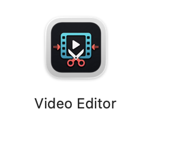
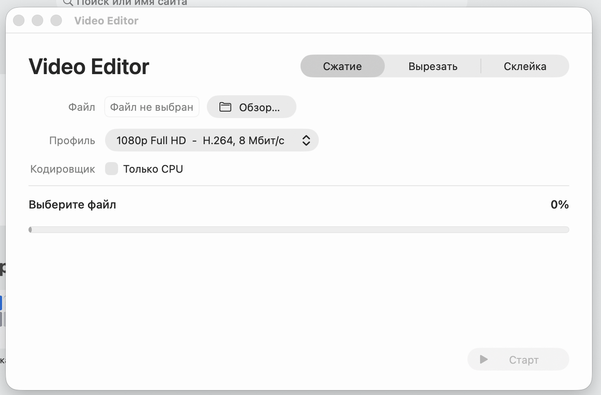
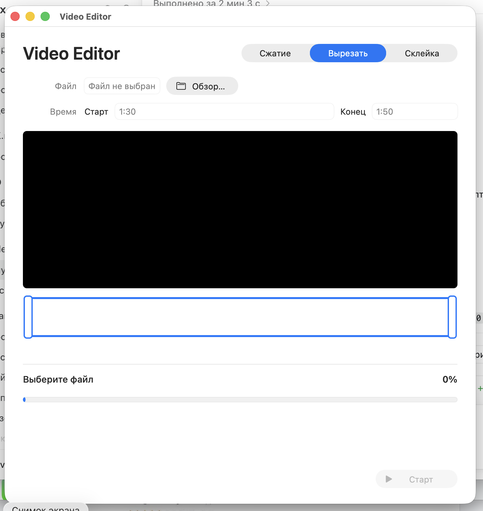
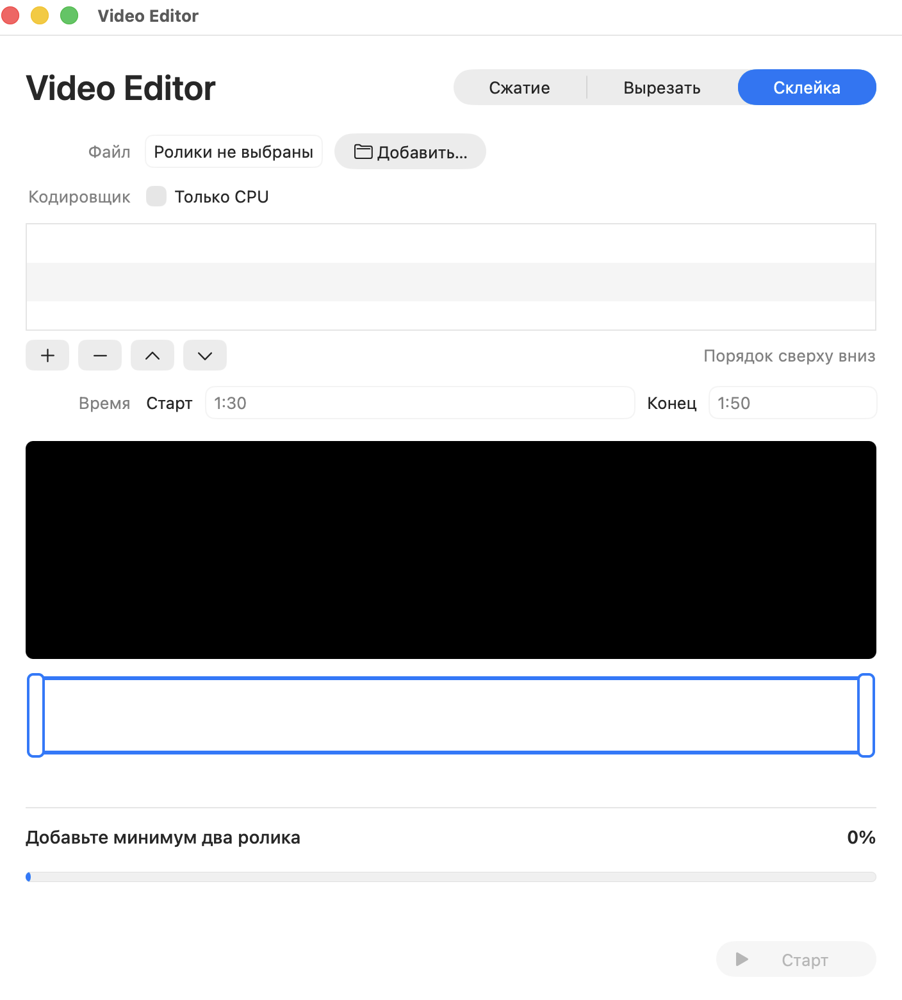

# Video Editor для macOS

<p align="center">
  
</p>

Video Editor — простое и полностью бесплатное приложение для компьютеров Mac с процессорами Apple Silicon и macOS 13 Ventura или новее. Оно позволяет сжимать видео, вырезать фрагменты и объединять несколько роликов в одном нативном интерфейсе macOS.

Готовая сборка: [`dist/Video-Editor-3.6-arm64.zip`](dist/Video-Editor-3.6-arm64.zip).

[Полная история изменений](CHANGELOG.md).

## Интерфейс

Приложение объединяет три операции в одном нативном интерфейсе macOS. Переключение между режимами выполняется в верхней части окна, а выбранная операция, прогресс и техническая информация отображаются без открытия Terminal.

### Сжатие видео

Выбор готового профиля качества, автоматический анализ исходника и возможность принудительно использовать CPU вместо аппаратного кодировщика Apple VideoToolbox.



### Вырезание фрагмента

Встроенный просмотр, точные поля начала и конца, а также интерактивный таймлайн для визуального выбора нужного диапазона.



### Склейка роликов

Список исходных роликов с изменением порядка, индивидуальной обрезкой каждого клипа и предпросмотром перед созданием итогового MP4, MOV или MKV.



## Возможности

### Сжатие

- автоматический анализ разрешения, частоты кадров, кодека, битрейта, глубины цвета и HDR;
- работа с видеофайлами любых контейнеров и кодеков, которые поддерживает установленный FFmpeg;
- показ всех профилей с разрешением не выше исходного независимо от расширения и исходного битрейта;
- профили от 240p до 4K, включая YouTube 4K и компактный HEVC;
- сохранение исходных пропорций и поддержка горизонтального и вертикального видео;
- повышенный битрейт для видео 50/60 fps;
- аппаратное кодирование H.264/HEVC через Apple VideoToolbox;
- автоматический переход на программное кодирование, если аппаратный кодировщик не поддерживает выбранный режим;
- ручное отключение GPU и кодирование на CPU;
- AAC-дорожка копируется без потерь, остальные аудиоформаты преобразуются в AAC;
- MP4 и MOV оптимизируются для быстрого начала воспроизведения (`faststart`);
- переключатель **HDR 10-бит / SDR 8-бит** справа от списка профилей;
- сохранение HDR и 10-битного цвета при уменьшении разрешения через HEVC Main 10;
- преобразование HDR в совместимый SDR 8-бит с tone mapping;
- правильная обработка ориентации вертикальных роликов iPhone.

### Вырезание фрагментов

- встроенный видеоплеер;
- таймлайн с миниатюрами;
- выбор начала и конца перетаскиванием маркеров;
- перемещение всего выбранного диапазона;
- точный ввод времени;
- зацикленная предпросмотром выбранная область;
- вырезание без повторного кодирования и без потери качества;
- поддержка видео и аудиофайлов.

### Склейка роликов

- добавление сразу нескольких видео;
- изменение порядка роликов;
- удаление роликов из списка;
- индивидуальная обрезка начала и конца каждого клипа;
- предпросмотр и миниатюры для выбранного клипа;
- нормализация видео к единому размеру и формату;
- добавление тишины для роликов без аудиодорожки;
- результат в MP4, MOV или MKV: H.264/HEVC + AAC, 48 кГц, stereo;
- аппаратная склейка через VideoToolbox с возможностью переключиться на CPU.

### Контроль процесса

- общий процент выполнения и полоса прогресса;
- прошедшее и оставшееся время;
- скорость обработки;
- текущий и прогнозируемый размер результата;
- загрузка CPU, число занятых ядер и расход RAM;
- название активного кодировщика;
- безопасная отмена операции с удалением незавершённого файла;
- кнопка показа готового файла в Finder;
- защита от случайной перезаписи: при совпадении имени добавляется числовой суффикс.

### Возможности macOS

- нативный интерфейс на Swift и AppKit;
- просмотр видео через AVFoundation и AVKit;
- аппаратное кодирование H.264 и HEVC через Apple VideoToolbox;
- стандартные окна открытия и сохранения файлов macOS;
- интеграция с Finder;
- автоматическая поддержка светлого и тёмного оформления системы;
- системное сохранение настроек через `UserDefaults`.

### Русский и английский интерфейс

Язык можно изменить без перезапуска через верхнее меню **Язык / Language → Русский / English**. При первом запуске приложение использует язык macOS: русский для русской системы и английский для остальных языков.

Выбор автоматически сохраняется через стандартный механизм macOS `UserDefaults` и восстанавливается при следующем запуске. Настройка хранится в системном файле параметров приложения `~/Library/Preferences/ru.coloded.videoeditor.plist`; пользователю не нужно изменять его вручную.

## Профили сжатия

| Профиль | Видеокодек | Битрейт 24–30 fps | Битрейт 50–60 fps | Аудио |
| --- | --- | ---: | ---: | ---: |
| 240p | H.264 | 0,6 Мбит/с | 0,9 Мбит/с | 96 Кбит/с |
| 360p | H.264 | 1 Мбит/с | 1,5 Мбит/с | 96 Кбит/с |
| 480p | H.264 | 2,5 Мбит/с | 4 Мбит/с | 128 Кбит/с |
| 720p HD | H.264 | 5 Мбит/с | 7,5 Мбит/с | 128 Кбит/с |
| 1080p Full HD | H.264 | 8 Мбит/с | 12 Мбит/с | 192 Кбит/с |
| 1440p QHD | H.264 | 16 Мбит/с | 24 Мбит/с | 192 Кбит/с |
| 2160p 4K | H.264 | 40 Мбит/с | 60 Мбит/с | 192 Кбит/с |
| YouTube 4K SDR | H.264 | 40 Мбит/с | 60 Мбит/с | 192 Кбит/с |
| YouTube 4K Compact | HEVC | 24 Мбит/с | 36 Мбит/с | 192 Кбит/с |

Число в профиле обозначает короткую сторону кадра. Разрешение исходника никогда не увеличивается.

Для HDR/10-битного источника справа от профиля доступны две радиокнопки:

- **HDR 10-бит** — сохраняет HDR, использует HEVC Main 10 и уменьшенный HEVC-битрейт;
- **SDR 8-бит** — выполняет tone mapping и создаёт более совместимый H.264-файл.

Для обычного SDR-видео автоматически выбран режим SDR. Приложение показывает все профили, короткая сторона которых не превышает короткую сторону исходника; исходный битрейт больше не скрывает доступные варианты.

## Входные и выходные форматы

Video Editor определяет содержимое файла через FFmpeg, поэтому работа не ограничена только MOV или MP4. Поддержка конкретного файла зависит не только от расширения, но и от видео- и аудиокодеков внутри контейнера.

Распространённые входные расширения видео:

`.mov`, `.mp4`, `.m4v`, `.mkv`, `.avi`, `.webm`, `.mpg`, `.mpeg`, `.ts`, `.mts`, `.m2ts`, `.vob`, `.3gp`, `.flv`, `.wmv`, `.ogv`.

В режиме вырезания также можно открывать распространённые аудиофайлы: `.mp3`, `.m4a`, `.aac`, `.wav`, `.flac`, `.ogg` и `.opus`.

| Операция | Вход | Результат |
| --- | --- | --- |
| Сжатие SDR | Любой видеофайл из списка, который распознаёт FFmpeg | `.mp4`, `.mov` или `.mkv`: H.264, 8-битный SDR, AAC |
| Сжатие HDR | HDR/10-битное видео | `.mp4`, `.mov` или `.mkv`: HEVC Main 10, HLG/PQ HDR, AAC |
| HDR → SDR | HDR/10-битное видео | `.mp4`, `.mov` или `.mkv`: H.264, 8-битный SDR BT.709, AAC |
| Вырезание | Поддерживаемое видео или аудио | Контейнер и кодеки исходника сохраняются без повторного кодирования, если выбранное расширение с ними совместимо |
| Склейка | Два или более поддерживаемых видеофайла | `.mp4`, `.mov` или `.mkv`: H.264 или HEVC согласно выбранному профилю, AAC |

При сжатии AAC-дорожка копируется без потерь; другой поддерживаемый аудиокодек преобразуется в AAC. Приложение обрабатывает первую видеодорожку и первую аудиодорожку. Отдельный файл `.m2ts` открыть можно, если его понимает FFmpeg, но приложение не открывает Blu-ray/BDMV, зашифрованный диск или ISO-образ целиком.

Окно открытия показывает только перечисленные входные расширения. Окно сохранения после сжатия и склейки предлагает только `.mp4`, `.mov` и `.mkv`; формат выбирается стандартным списком типов файлов macOS. При обычном вырезании сохраняется расширение исходника, поскольку аудио- и видеопотоки копируются без перекодирования.

## Бесплатное приложение

Video Editor — простое и полностью бесплатное приложение. В нём нет рекламы, подписок, встроенных покупок, платных функций или обязательной регистрации.

Приложение распространяется «как есть». Автор не предоставляет гарантий и не несёт ответственности за возможную потерю данных или другие последствия использования. Перед обработкой важных файлов рекомендуется создавать резервные копии.

## Системные требования

- Mac с процессором Apple Silicon (`arm64`);
- macOS 13 Ventura или новее (проверены ветки macOS 13, 14, 15 и 26);
- [Homebrew](https://brew.sh/) и FFmpeg.

Установите FFmpeg:

```bash
brew install ffmpeg
```

FFmpeg не встроен в приложение. При первом запуске Video Editor проверяет наличие `ffmpeg` и `ffprobe` в стандартных каталогах Homebrew и показывает инструкцию, если они не найдены.

## Установка готового приложения

1. Скачайте [`Video-Editor-3.6-arm64.zip`](dist/Video-Editor-3.6-arm64.zip).
2. Распакуйте архив.
3. Перетащите `Video Editor.app` в папку `Программы` (`Applications`).
4. Установите FFmpeg командой `brew install ffmpeg`, если он ещё не установлен.
5. Запустите приложение.

Сборка подписана локальной ad-hoc подписью, но не нотарифицирована Apple. Если macOS блокирует первый запуск, откройте **Системные настройки → Конфиденциальность и безопасность** и подтвердите запуск либо нажмите по приложению правой кнопкой мыши и выберите **Открыть**.

## Использование GUI

### Сжать видео

1. Выберите режим **Сжатие**.
2. Нажмите **Обзор…** и выберите видео.
3. Дождитесь анализа исходника.
4. Выберите профиль с нужным разрешением.
5. Для HDR-видео выберите **HDR 10-бит** или **SDR 8-бит**.
6. При необходимости включите кодирование процессором и нажмите **Сжать**.

### Вырезать фрагмент

1. Выберите режим **Вырезать**.
2. Откройте видео или аудиофайл.
3. Установите границы на таймлайне или введите время вручную.
4. Нажмите **Вырезать**.

### Склеить ролики

1. Выберите режим **Склейка**.
2. Добавьте минимум два ролика.
3. Расставьте их в нужном порядке кнопками вверх/вниз.
4. При необходимости выберите каждый клип и измените его границы.
5. Нажмите **Склеить**.

Готовые файлы сохраняются рядом с исходником. Для склейки используется папка первого ролика.

## Сборка из исходников

Сборка предназначена для Mac с процессором Apple Silicon. Перед сборкой можно отдельно проверить окружение — приложение при этом не создаётся:

```bash
./VideoEditorMac/build_app.sh --check-only
```

Для обычной сборки выполните:

```bash
./VideoEditorMac/build_app.sh
```

Перед началом скрипт проверяет исходники, `Info.plist`, иконку, свободное место, Apple Command Line Tools, Swift, macOS SDK 13 или новее, системные утилиты, FFmpeg и `ffprobe`.

Если Apple Command Line Tools не установлены, скрипт сообщает об этом и предлагает открыть системное окно установки. Если отсутствует FFmpeg, он объясняет, что требуется установить, и с разрешения пользователя запускает `brew install ffmpeg`. При отсутствии Homebrew выводятся адрес [brew.sh](https://brew.sh/) и точная команда для ручной установки. Системные компоненты и зависимости не устанавливаются без подтверждения пользователя.

Дополнительные параметры:

- `--check-only` — только проверить окружение;
- `--skip-runtime-check` — собрать приложение без проверки FFmpeg и `ffprobe`;
- `--help` — показать справку.

После успешных проверок скрипт:

1. компилирует `VideoEditorMac/Sources/main.swift` под `arm64`;
2. создаёт структуру `Video Editor.app`;
3. добавляет внутренний FFmpeg-движок и иконку;
4. подписывает bundle ad-hoc подписью;
5. проверяет архитектуру, `Info.plist` и подпись;
6. помещает готовое приложение в корень проекта.

Если финальная замена приложения прерывается или завершается ошибкой, скрипт пытается восстановить предыдущую сборку.

## Структура проекта

```text
VideoEditorMac/
├── Sources/main.swift          # GUI на Swift/AppKit
├── Resources/
│   ├── AppIcon-master.png
│   └── video_engine            # внутренний движок приложения
├── Info.plist
└── build_app.sh                # сборка arm64-приложения
dist/                           # готовая сборка
```

## Технические детали и ограничения

- GUI написан без сторонних Swift-зависимостей: AppKit, AVFoundation, AVKit и UniformTypeIdentifiers.
- Для обработки используется первая видеодорожка и первая аудиодорожка.
- Обычная обрезка работает через stream copy; граница может привязываться к ближайшему ключевому кадру исходника.
- Склейка выполняет повторное кодирование для приведения разных роликов к общим параметрам.
- Поддержка конкретного входного контейнера и кодека зависит от установленной версии FFmpeg.
- При сохранении HDR используется совместимая HLG/PQ-основа; динамические метаданные Dolby Vision исходника не переносятся в новый файл.
- Готовый ZIP содержит только сборку для Apple Silicon; Intel Mac не поддерживается.

## Версия

Текущая версия приложения: **3.6** (build 9).
